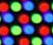

# [Miyoo Mini + OnionOS] CRT layout and Filter
CRT layout and Filter for Miyoo Mini + under OnionOS

## Description
The frame and `.so` filter ware taken from [OnionUI/Onion/discussions #708](https://github.com/OnionUI/Onion/discussions/708)
What I did was:
- Added smoothing bloor to frame png.
- Create `.filt` edit to `.so` filter, to prevent resolution change.
- New CRT `.png` pattern done by hand, using this as a reference:
- - 

## Comparison
### Darkwing Duck (U) [NES]
 |-Nothing-|NTSC Filter
:--|---|---
-Nothing-|%20[!].png)|%20[!]_NTSC.png)
CRT Layout|%20[!]_CRT.png)|%20[!]_CRT+NTSC.png)

### Fox Junction (J) [PSX]
 |-Nothing-|NTSC Filter
:--|---|---
-Nothing-|.png)|_NTSC.png)
CRT Layout|_CRT.png)|_CRT+NTSC.png)

### Shinsetsu Samurai Spirits - Bushidou Retsuden (J) [NEOGEO CD]
 |-Nothing-|NTSC Filter
:--|---|---
-Nothing-|.png)|_NTSC.png)
CRT Layout|_CRT.png)|_CRT+NTSC.png)

## Changes:
- Replaced wrong filter's .filt file.
- The .png layout file is still v,2.
- Compared to original v.1 the frame is smoother and the .psd and .xcf files ware extended to have more customization.

## Useful resources:
- https://github.com/CyberLabSystems/CyberLab-Custom-Blargg-NTSC-Video-Filter-Presets/releases
- https://github.com/drkhrse/drkhrse_miyoo_bezels/releases
- https://aegis.disinfo.zone/user/1playerinsertcoin
- https://www.reddit.com/r/MiyooMini/comments/17tf2hu/miyoo_mini_plus_bezel_pack_download
- https://www.reddit.com/r/MiyooMini/comments/1616xs3/i_adjusted_all_825_sgb_borders_as_gbgbc_overlays/
