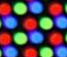

# [Miyoo Mini + OnionOS] CRT layout and Filter
CRT layout and Filter for Miyoo Mini + under OnionOS

- The frame was done using someone's pack, but it was edited.
- The `.so` filter file is from someone's pack. I just created the `.filt` to stop it from changing resolution.
- The pattern itself was done by hand, using this as a refrence:

